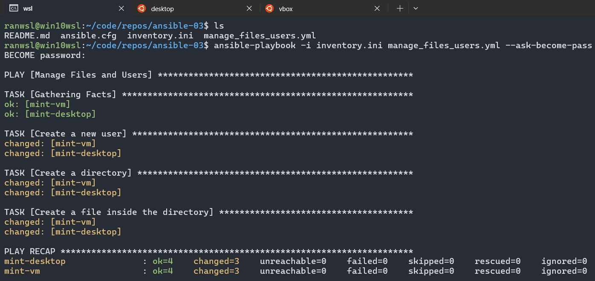

# ansible-03

## File Management and User Creation

## Overview

This project demonstrates how to use Ansible to create a user, set up directories, and manage files on remote Linux machines.

## Inventory Configuration

Create an `inventory.ini` file with the following structure:

```ini
[linux_mint]
mint-desktop ansible_host=<MINT_DESKTOP_IP> ansible_user=<YOUR_USER>
mint-vm ansible_host=<MINT_VM_IP> ansible_user=<YOUR_USER>
```

Replace `<MINT_DESKTOP_IP>`, `<MINT_VM_IP>`, and `<YOUR_USER>` with actual values.

## Playbook: `manage_files_users.yml`

Create a playbook named `manage_files_users.yml`:

```yaml
- name: Manage Files and Users
  hosts: linux_mint
  become: true
  tasks:
    - name: Create a new user
      user:
        name: devops
        state: present
        groups: sudo

    - name: Create a directory
      file:
        path: /home/devops/project
        state: directory
        owner: devops
        group: devops
        mode: '0755'

    - name: Create a file inside the directory
      copy:
        content: "Welcome to Ansible File Management"
        dest: /home/devops/project/info.txt
        owner: devops
        group: devops
        mode: '0644'
```

## Explanation of the Playbook

The `manage_files_users.yml` playbook performs three key tasks on remote Linux machines:

1. **Create a User (`devops`)**  
   - Uses the `user` module to create a new user named `devops`.  
   - Ensures the user exists (`state: present`).  
   - Adds the user to the `sudo` group for administrative privileges.  

2. **Create a Directory (`/home/devops/project`)**  
   - Uses the `file` module to create the directory if it does not exist.  
   - Assigns ownership to the `devops` user and group.  
   - Sets the directory's permissions to `0755` (owner can read/write/execute, others can read/execute).  

3. **Create a File (`/home/devops/project/info.txt`)**  
   - Uses the `copy` module to create a text file inside the directory.  
   - Writes "Welcome to Ansible File Management" as its content.  
   - Assigns ownership to the `devops` user and group.  
   - Sets the file permissions to `0644` (owner can read/write, others can read).  

## Running the Playbook

Execute the playbook with:

```bash
ansible-playbook -i inventory.ini manage_files_users.yml --ask-become-pass
```



## Verification

Check if the user was created:

```bash
ansible linux_mint -i inventory.ini -m shell -a "id devops"
```
